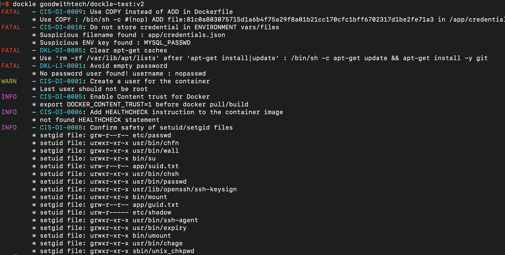
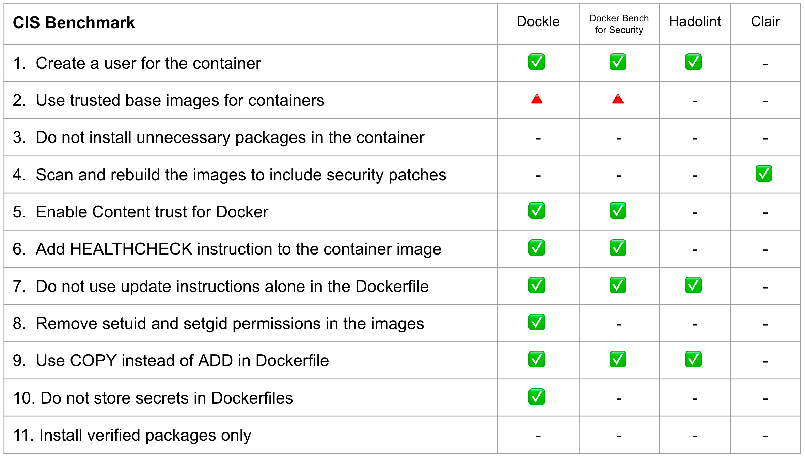
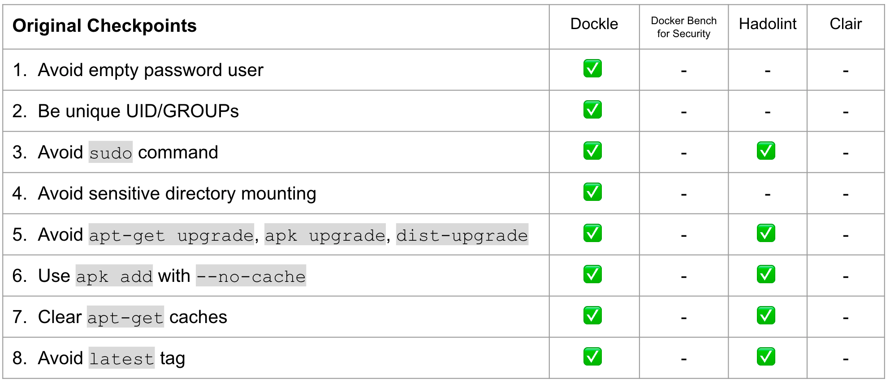

[](https://opencollective.com/dockle) [](https://github.com/goodwithtech/dockle/releases/latest)
[](https://circleci.com/gh/goodwithtech/dockle)
[](https://goreportcard.com/report/github.com/goodwithtech/dockle)
[](https://www.gnu.org/licenses/agpl-3.0)

> Dockle - Container Image Linter for Security, Helping build the Best-Practice Docker Image, Easy to start

`Dockle` helps you:

1. Build [Best Practice](https://docs.docker.com/develop/develop-images/dockerfile_best-practices/) Docker images
2. Build secure Docker images
    - Checkpoints includes [CIS Benchmarks](https://www.cisecurity.org/cis-benchmarks/)

```bash
$ brew untap goodwithtech/dockle # who use 0.1.16 or older version
$ brew install goodwithtech/r/dockle
$ dockle [YOUR_IMAGE_NAME]
```
See [Installation](#installation) and [Common Examples](#common-examples)



# Checkpoints Comparison




# TOC

- [Features](#features)
- [Comparison](#comparison)
- [Installation](#installation)
  - [Homebrew (Mac OS X / Linux and WSL)](#homebrew-mac-os-x--linux-and-wsl)
  - [RHEL/CentOS](#rhelcentos)
  - [Debian/Ubuntu](#debianubuntu)
  - [Arch Linux](#arch-linux)
  - [Windows](#windows)
  - [Microsoft PowerShell 7](#microsoft-powershell-7)
  - [Binary](#binary)
  - [asdf](#asdf)
  - [From source](#from-source)
  - [Use Docker](#use-docker)
- [Quick Start](#quick-start)
  - [Basic](#basic)
  - [Docker](#docker)
- [Checkpoint Summary](#checkpoint-summary)
- [Common Examples](#common-examples)
  - [Scan an image](#scan-an-image)
  - [Scan an image file](#scan-an-image-file)
  - [Get or Save the results as JSON](#get-or-save-the-results-as-json)
  - [Specify exit code](#specify-exit-code)
  - [Specify exit level](#specify-exit-level)
  - [Ignore the specified checkpoints](#ignore-the-specified-checkpoints)
- [Continuous Integration](#continuous-integration-ci)
  - [GitHub Action](#github-action)
  - [Travis CI](#travis-ci)
  - [CircleCI](#circleci)
  - [GitLab CI](#gitlab-ci)
  - [Authorization for Private Docker Registry](#authorization-for-private-docker-registry) 
- [Checkpoint Details](CHECKPOINT.md)
  - CIS's Docker Image Checkpoints
  - Dockle Checkpoints for Docker
  - Dockle Checkpoints for Linux
- [Credits](#credits)
- [Roadmap](#roadmap)

# Features

- Detect container's vulnerabilities
- Helping build best-practice Dockerfile
- Simple usage
  - Specify only the image name
  - See [Quick Start](#quick-start) and [Common Examples](#common-examples)
- CIS Benchmarks Support
  - High accuracy
- DevSecOps
  - Suitable for CI such as Travis CI, CircleCI, Jenkins, etc.
  - See [CI Example](#continuous-integration-ci)

# Comparison

|  | [Dockle](https://github.com/goodwithtech/dockle) | [Hadolint](https://github.com/hadolint/hadolint) | [Docker Bench for Security](https://github.com/docker/docker-bench-security) | [Clair](https://github.com/coreos/clair) |
|--- |---:|---:|---:|---:|
| Target |  Image | Dockerfile | Host<br/>Docker Daemon<br/>Image<br/>Container Runtime | Image |
| How to run | Binary | Binary | ShellScript | Binary |
| Dependency | No | No | Some dependencies | No |
| CI Suitable | ✓ | ✓ | x | x | 
| Purpose |Security Audit<br/>Dockerfile Lint| Dockerfile Lint | Security Audit<br/>Dockerfile Lint | Scan Vulnerabilities |

# Installation

## Homebrew (Mac OS X / Linux and WSL)

You can use Homebrew on [Mac OS X](https://brew.sh/) or [Linux and WSL (Windows Subsystem for Linux)](https://docs.brew.sh/Homebrew-on-Linux).

```bash
$ brew install goodwithtech/r/dockle
```

## RHEL/CentOS

```bash
VERSION=$(
 curl --silent "https://api.github.com/repos/goodwithtech/dockle/releases/latest" | \
 grep '"tag_name":' | \
 sed -E 's/.*"v([^"]+)".*/\1/' \
) && rpm -ivh https://github.com/goodwithtech/dockle/releases/download/v${VERSION}/dockle_${VERSION}_Linux-64bit.rpm
```

## Debian/Ubuntu

```bash
VERSION=$(
 curl --silent "https://api.github.com/repos/goodwithtech/dockle/releases/latest" | \
 grep '"tag_name":' | \
 sed -E 's/.*"v([^"]+)".*/\1/' \
) && curl -L -o dockle.deb https://github.com/goodwithtech/dockle/releases/download/v${VERSION}/dockle_${VERSION}_Linux-64bit.deb
$ sudo dpkg -i dockle.deb && rm dockle.deb
```
## Arch Linux
dockle can be installed from the Arch User Repository using `dockle` or `dockle-bin` package.
```
git clone https://aur.archlinux.org/dockle-bin.git
cd dockle-bin
makepkg -sri
```
## Windows

```bash
VERSION=$(
 curl --silent "https://api.github.com/repos/goodwithtech/dockle/releases/latest" | \
 grep '"tag_name":' | \
 sed -E 's/.*"v([^"]+)".*/\1/' \
) && curl -L -o dockle.zip https://github.com/goodwithtech/dockle/releases/download/v${VERSION}/dockle_${VERSION}_Windows-64bit.zip
$ unzip dockle.zip && rm dockle.zip
$ ./dockle.exe [IMAGE_NAME]
```
## Microsoft PowerShell 7
```bash
if (((Invoke-WebRequest "https://api.github.com/repos/goodwithtech/dockle/releases/latest").Content) -match '"tag_name":"v(?<ver>[^"]+)"') {
$VERSION=$Matches.ver &&
Invoke-WebRequest "https://github.com/goodwithtech/dockle/releases/download/v${VERSION}/dockle_${VERSION}_Windows-64bit.zip" -OutFile dockle.zip &&
Expand-Archive dockle.zip && Remove-Item dockle.zip }
```
## Binary

You can get the latest version binary from [releases page](https://github.com/goodwithtech/dockle/releases/latest).

Download the archive file for your operating system/architecture. Unpack the archive, and put the binary somewhere in your `$PATH` (on UNIX-y systems, `/usr/local/bin` or the like).

- NOTE: Make sure that it's execution bits turned on. (`chmod +x dockle`)

## asdf

You can install dockle with the [asdf version manager](https://asdf-vm.com/) with this [plugin](https://github.com/mathew-fleisch/asdf-dockle), which automates the process of installing (and switching between) various versions of github release binaries. With asdf already installed, run these commands to install dockle:

```bash
# Add dockle plugin
asdf plugin add dockle

# Show all installable versions
asdf list-all dockle

# Install specific version
asdf install dockle latest

# Set a version globally (on your ~/.tool-versions file)
asdf global dockle latest

# Now dockle commands are available
dockle --version
```

## From source

```bash
$ GO111MODULE=off go get github.com/goodwithtech/dockle/cmd/dockle
$ cd $GOPATH/src/github.com/goodwithtech/dockle && GO111MODULE=on go build -o $GOPATH/bin/dockle cmd/dockle/main.go
```

## Use Docker

There's a [`Dockle` image on Docker Hub](https://hub.docker.com/r/goodwithtech/dockle) also. You can try `dockle` before installing the command.

```
$ VERSION=$(
 curl --silent "https://api.github.com/repos/goodwithtech/dockle/releases/latest" | \
 grep '"tag_name":' | \
 sed -E 's/.*"v([^"]+)".*/\1/' \
) && docker run --rm -v /var/run/docker.sock:/var/run/docker.sock \
  goodwithtech/dockle:v${VERSION} [YOUR_IMAGE_NAME]
```

You only need `-v /var/run/docker.sock:/var/run/docker.sock` when you'd like to scan the image on your host machine.

# Quick Start

## Basic

Simply specify an image name (and a tag).

```bash
$ dockle [YOUR_IMAGE_NAME]
```

<details>
<summary>Result</summary>

```
FATAL   - CIS-DI-0009: Use COPY instead of ADD in Dockerfile
        * Use COPY : /bin/sh -c #(nop) ADD file:81c0a803075715d1a6b4f75a29f8a01b21cc170cfc1bff6702317d1be2fe71a3 in /app/credentials.json
FATAL   - CIS-DI-0010: Do not store credential in ENVIRONMENT vars/files
        * Suspicious filename found : app/credentials.json
FATAL   - DKL-DI-0005: Clear apt-get caches
        * Use 'rm -rf /var/lib/apt/lists' after 'apt-get install' : /bin/sh -c apt-get update && apt-get install -y git
FATAL   - DKL-LI-0001: Avoid empty password
        * No password user found! username : nopasswd
WARN    - CIS-DI-0001: Create a user for the container
        * Last user should not be root
INFO    - CIS-DI-0005: Enable Content trust for Docker
        * export DOCKER_CONTENT_TRUST=1 before docker pull/build
INFO    - CIS-DI-0008: Confirm safety of setuid/setgid files
        * setuid file: app/suid.txt urw-r--r--
        * setgid file: app/gid.txt grw-r--r--
        * setuid file: usr/bin/gpasswd urwxr-xr-x
        * setgid file: usr/bin/wall grwxr-xr-x
        * setuid file: bin/su urwxr-xr-x
        * setuid file: bin/umount urwxr-xr-x
        * setuid file: bin/mount urwxr-xr-x
        * setgid file: usr/bin/ssh-agent grwxr-xr-x
        * setuid file: etc/shadow urw-r-----
        * setuid file: usr/bin/chsh urwxr-xr-x
        * setuid file: usr/bin/chfn urwxr-xr-x
        * setuid file: usr/lib/openssh/ssh-keysign urwxr-xr-x
        * setgid file: etc/passwd grw-r--r--
        * setgid file: sbin/unix_chkpwd grwxr-xr-x
        * setgid file: usr/bin/chage grwxr-xr-x
        * setuid file: usr/bin/passwd urwxr-xr-x
        * setgid file: usr/bin/expiry grwxr-xr-x
        * setuid file: usr/bin/newgrp urwxr-xr-x
IGNORE  - CIS-DI-0006: Add HEALTHCHECK instruction to the container image

```

</details>

## Docker

Also, you can use Docker to use `dockle` command as follow.

```bash
$ export DOCKLE_LATEST=$(
 curl --silent "https://api.github.com/repos/goodwithtech/dockle/releases/latest" | \
 grep '"tag_name":' | \
 sed -E 's/.*"v([^"]+)".*/\1/' \
)
$ docker run --rm goodwithtech/dockle:v${DOCKLE_LATEST} [YOUR_IMAGE_NAME]
```

- If you'd like to scan the image on your host machine, you need to mount `docker.sock`.

    ```bash
    $ docker run --rm -v /var/run/docker.sock:/var/run/docker.sock ...
    ```

# Checkpoint Summary

- Details of each checkpoint see [CHECKPOINT.md](CHECKPOINT.md)

| CODE | DESCRIPTION | LEVEL[※](#level) |
|---|---|:---:|
| | [CIS's Docker Image Checkpoints](CHECKPOINT.md#docker-image-checkpoints) | |
| [CIS-DI-0001](CHECKPOINT.md#cis-di-0001) | Create a user for the container | WARN |
| [CIS-DI-0002](CHECKPOINT.md#cis-di-0002) | Use trusted base images for containers | FATAL
| [CIS-DI-0003](CHECKPOINT.md#cis-di-0003) | Do not install unnecessary packages in the container | FATAL
| [CIS-DI-0004](CHECKPOINT.md#cis-di-0004) | Scan and rebuild the images to include security patches | FATAL
| [CIS-DI-0005](CHECKPOINT.md#cis-di-0005) | Enable Content trust for Docker | INFO
| [CIS-DI-0006](CHECKPOINT.md#cis-di-0006) | Add `HEALTHCHECK` instruction to the container image | WARN
| [CIS-DI-0007](CHECKPOINT.md#cis-di-0007) | Do not use `update` instructions alone in the Dockerfile | FATAL
| [CIS-DI-0008](CHECKPOINT.md#cis-di-0008) | Confirm safety of `setuid` and `setgid` files | INFO
| [CIS-DI-0009](CHECKPOINT.md#cis-di-0009) | Use `COPY` instead of `ADD` in Dockerfile | FATAL
| [CIS-DI-0010](CHECKPOINT.md#cis-di-0010) | Do not store secrets in Dockerfiles | FATAL
| [CIS-DI-0011](CHECKPOINT.md#cis-di-0011) | Install verified packages only | INFO
|| [Dockle Checkpoints for Docker](CHECKPOINT.md#dockle-checkpoints-for-docker) |
| [DKL-DI-0001](CHECKPOINT.md#dkl-di-0001) | Avoid `sudo` command | FATAL
| [DKL-DI-0002](CHECKPOINT.md#dkl-di-0002) | Avoid sensitive directory mounting | FATAL
| [DKL-DI-0003](CHECKPOINT.md#dkl-di-0003) | Avoid `apt-get dist-upgrade` | WARN
| [DKL-DI-0004](CHECKPOINT.md#dkl-di-0004) | Use `apk add` with `--no-cache` | FATAL
| [DKL-DI-0005](CHECKPOINT.md#dkl-di-0005) | Clear `apt-get` caches | FATAL
| [DKL-DI-0006](CHECKPOINT.md#dkl-di-0006) | Avoid `latest` tag | WARN
|| [Dockle Checkpoints for Linux](CHECKPOINT.md#dockerdockle-checkpoints-for-linux) |
| [DKL-LI-0001](CHECKPOINT.md#dkl-li-0001) | Avoid empty password | FATAL
| [DKL-LI-0002](CHECKPOINT.md#dkl-li-0002) | Be unique UID/GROUPs | FATAL
| [DKL-LI-0003](CHECKPOINT.md#dkl-li-0003) | Only put necessary files | INFO

## Level

`Dockle` has 5 check levels.

| LEVEL | DESCRIPTION |
|:---:|---|
| FATAL | Be practical and prudent |
| WARN | Be practical and prudent, but limited uses (even if official images) |
| INFO | May negatively inhibit the utility or performance |
| SKIP | Not found target files |
| PASS | Not found any problems |

## Common Examples

### Scan an image

Simply specify an image name (and a tag).

```bash
$ dockle goodwithtech/test-image:v1
```

<details>
<summary>Result</summary>

```
FATAL   - CIS-DI-0001: Create a user for the container
        * Last user should not be root
WARN    - CIS-DI-0005: Enable Content trust for Docker
        * export DOCKER_CONTENT_TRUST=1 before docker pull/build
FATAL   - CIS-DI-0006: Add HEALTHCHECK instruction to the container image
        * not found HEALTHCHECK statement
FATAL   - CIS-DI-0007: Do not use update instructions alone in the Dockerfile
        * Use 'Always combine RUN 'apt-get update' with 'apt-get install' : /bin/sh -c apt-get update && apt-get install -y git
FATAL   - CIS-DI-0008: Remove setuid and setgid permissions in the images
        * Found setuid file: etc/passwd grw-r--r--
        * Found setuid file: usr/lib/openssh/ssh-keysign urwxr-xr-x
        * Found setuid file: app/hoge.txt ugrw-r--r--
        * Found setuid file: app/hoge.txt ugrw-r--r--
        * Found setuid file: etc/shadow urw-r-----
FATAL   - CIS-DI-0009: Use COPY instead of ADD in Dockerfile
        * Use COPY : /bin/sh -c #(nop) ADD file:81c0a803075715d1a6b4f75a29f8a01b21cc170cfc1bff6702317d1be2fe71a3 in /app/credentials.json
FATAL   - CIS-DI-0010: Do not store secrets in ENVIRONMENT variables
        * Suspicious ENV key found : MYSQL_PASSWD
FATAL   - CIS-DI-0010: Do not store secret files
        * Suspicious filename found : app/credentials.json
PASS    - DKL-DI-0001: Avoid sudo command
FATAL   - DKL-DI-0002: Avoid sensitive directory mounting
        * Avoid mounting sensitive dirs : /usr
PASS    - DKL-DI-0003: Avoid apt-get/apk/dist-upgrade
PASS    - DKL-DI-0004: Use apk add with --no-cache
FATAL   - DKL-DI-0005: Clear apt-get caches
        * Use 'apt-get clean && rm -rf /var/lib/apt/lists/*' : /bin/sh -c apt-get update && apt-get install -y git
PASS    - DKL-DI-0006: Avoid latest tag
FATAL   - DKL-LI-0001: Avoid empty password
        * No password user found! username : nopasswd
PASS    - DKL-LI-0002: Be unique UID
PASS    - DKL-LI-0002: Be unique GROUP
```
</details>

### Scan an image file

```bash
$ docker save alpine:latest -o alpine.tar
$ dockle --input alpine.tar
```

### Get or Save the results as JSON

```bash
$ dockle -f json goodwithtech/test-image:v1
$ dockle -f json -o results.json goodwithtech/test-image:v1
```

<details>
<summary>Result</summary>

```json
{
  "summary": {
    "fatal": 6,
    "warn": 2,
    "info": 2,
    "pass": 7
  },
  "details": [
    {
      "code": "CIS-DI-0001",
      "title": "Create a user for the container",
      "level": "WARN",
      "alerts": [
        "Last user should not be root"
      ]
    },
    {
      "code": "CIS-DI-0005",
      "title": "Enable Content trust for Docker",
      "level": "INFO",
      "alerts": [
        "export DOCKER_CONTENT_TRUST=1 before docker pull/build"
      ]
    },
    {
      "code": "CIS-DI-0006",
      "title": "Add HEALTHCHECK instruction to the container image",
      "level": "WARN",
      "alerts": [
        "not found HEALTHCHECK statement"
      ]
    },
    {
      "code": "CIS-DI-0008",
      "title": "Remove setuid and setgid permissions in the images",
      "level": "INFO",
      "alerts": [
        "Found setuid file: usr/lib/openssh/ssh-keysign urwxr-xr-x"
      ]
    },
    {
      "code": "CIS-DI-0009",
      "title": "Use COPY instead of ADD in Dockerfile",
      "level": "FATAL",
      "alerts": [
        "Use COPY : /bin/sh -c #(nop) ADD file:81c0a803075715d1a6b4f75a29f8a01b21cc170cfc1bff6702317d1be2fe71a3 in /app/credentials.json "
      ]
    },
    {
      "code": "CIS-DI-0010",
      "title": "Do not store secrets in ENVIRONMENT variables",
      "level": "FATAL",
      "alerts": [
        "Suspicious ENV key found : MYSQL_PASSWD"
      ]
    },
    {
      "code": "CIS-DI-0010",
      "title": "Do not store secret files",
      "level": "FATAL",
      "alerts": [
        "Suspicious filename found : app/credentials.json "
      ]
    },
    {
      "code": "DKL-DI-0002",
      "title": "Avoid sensitive directory mounting",
      "level": "FATAL",
      "alerts": [
        "Avoid mounting sensitive dirs : /usr"
      ]
    },
    {
      "code": "DKL-DI-0005",
      "title": "Clear apt-get caches",
      "level": "FATAL",
      "alerts": [
        "Use 'rm -rf /var/lib/apt/lists' after 'apt-get install' : /bin/sh -c apt-get update \u0026\u0026 apt-get install -y git"
      ]
    },
    {
      "code": "DKL-LI-0001",
      "title": "Avoid empty password",
      "level": "FATAL",
      "alerts": [
        "No password user found! username : nopasswd"
      ]
    }
  ]
}
```

</details>

### Get or Save the results as SARIF

```bash
$ dockle -f sarif goodwithtech/test-image:v1
$ dockle -f sarif -o results.json goodwithtech/test-image:v1
```

<details>
<summary>Result</summary>

```json
{
  "version": "2.1.0",
  "$schema": "https://raw.githubusercontent.com/oasis-tcs/sarif-spec/master/Schemata/sarif-schema-2.1.0.json",
  "runs": [
    {
      "tool": {
        "driver": {
          "name": "Dockle",
          "informationUri": "https://github.com/goodwithtech/dockle",
          "rules": [
            {
              "id": "CIS-DI-0009",
              "shortDescription": {
                "text": "Use COPY instead of ADD in Dockerfile"
              },
              "help": {
                "text": "https://github.com/goodwithtech/dockle/blob/master/CHECKPOINT.md#CIS-DI-0009"
              }
            },
            {
              "id": "CIS-DI-0010",
              "shortDescription": {
                "text": "Do not store credential in ENVIRONMENT vars/files"
              },
              "help": {
                "text": "https://github.com/goodwithtech/dockle/blob/master/CHECKPOINT.md#CIS-DI-0010"
              }
            },
            {
              "id": "DKL-DI-0005",
              "shortDescription": {
                "text": "Clear apt-get caches"
              },
              "help": {
                "text": "https://github.com/goodwithtech/dockle/blob/master/CHECKPOINT.md#DKL-DI-0005"
              }
            },
            {
              "id": "DKL-LI-0001",
              "shortDescription": {
                "text": "Avoid empty password"
              },
              "help": {
                "text": "https://github.com/goodwithtech/dockle/blob/master/CHECKPOINT.md#DKL-LI-0001"
              }
            },
            {
              "id": "CIS-DI-0005",
              "shortDescription": {
                "text": "Enable Content trust for Docker"
              },
              "help": {
                "text": "https://github.com/goodwithtech/dockle/blob/master/CHECKPOINT.md#CIS-DI-0005"
              }
            },
            {
              "id": "CIS-DI-0008",
              "shortDescription": {
                "text": "Confirm safety of setuid/setgid files"
              },
              "help": {
                "text": "https://github.com/goodwithtech/dockle/blob/master/CHECKPOINT.md#CIS-DI-0008"
              }
            },
            {
              "id": "CIS-DI-0001",
              "shortDescription": {
                "text": "Create a user for the container"
              },
              "help": {
                "text": "https://github.com/goodwithtech/dockle/blob/master/CHECKPOINT.md#CIS-DI-0001"
              }
            },
            {
              "id": "CIS-DI-0006",
              "shortDescription": {
                "text": "Add HEALTHCHECK instruction to the container image"
              },
              "help": {
                "text": "https://github.com/goodwithtech/dockle/blob/master/CHECKPOINT.md#CIS-DI-0006"
              }
            }
          ]
        }
      },
      "results": [
        {
          "ruleId": "CIS-DI-0009",
          "level": "error",
          "message": {
            "text": "Use COPY : /bin/sh -c #(nop) ADD file:81c0a803075715d1a6b4f75a29f8a01b21cc170cfc1bff6702317d1be2fe71a3 in /app/credentials.json "
          }
        },
        {
          "ruleId": "CIS-DI-0010",
          "level": "error",
          "message": {
            "text": "Suspicious filename found : app/credentials.json , Suspicious ENV key found : MYSQL_PASSWD"
          }
        },
        {
          "ruleId": "DKL-DI-0005",
          "level": "error",
          "message": {
            "text": "Use 'rm -rf /var/lib/apt/lists' after 'apt-get install' : /bin/sh -c apt-get update \u0026\u0026 apt-get install -y git"
          }
        },
        {
          "ruleId": "DKL-LI-0001",
          "level": "error",
          "message": {
            "text": "No password user found! username : nopasswd"
          }
        },
        {
          "ruleId": "CIS-DI-0005",
          "level": "note",
          "message": {
            "text": "export DOCKER_CONTENT_TRUST=1 before docker pull/build"
          }
        },
        {
          "ruleId": "CIS-DI-0008",
          "level": "note",
          "message": {
            "text": "setuid file: urwxr-xr-x usr/bin/newgrp, setgid file: grwxr-xr-x usr/bin/ssh-agent, setgid file: grwxr-xr-x usr/bin/expiry, setuid file: urwxr-xr-x usr/lib/openssh/ssh-keysign, setuid file: urwxr-xr-x bin/umount, setgid file: grwxr-xr-x usr/bin/chage, setuid file: urwxr-xr-x usr/bin/passwd, setgid file: grwxr-xr-x sbin/unix_chkpwd, setuid file: urwxr-xr-x usr/bin/chsh, setgid file: grwxr-xr-x usr/bin/wall, setuid file: urwxr-xr-x bin/ping, setuid file: urwxr-xr-x bin/su, setuid file: urwxr-xr-x usr/bin/chfn, setuid file: urwxr-xr-x usr/bin/gpasswd, setuid file: urwxr-xr-x bin/mount"
          }
        },
        {
          "ruleId": "CIS-DI-0001",
          "level": "none",
          "message": {
            "text": "Last user should not be root"
          }
        },
        {
          "ruleId": "CIS-DI-0006",
          "level": "none",
          "message": {
            "text": "not found HEALTHCHECK statement"
          }
        }
      ]
    }
  ]
}
```
</details>

### Specify exit code

By default, `Dockle` exits with code `0` even if there are some problems.

Use the `--exit-code, -c` option to exit with a non-zero exit code if `WARN` or `FATAL` alert were found.

```bash
$ dockle --exit-code 1 [IMAGE_NAME]
```

### Specify exit level

By default, `--exit-code` run when there are `WARN` or `FATAL` level alerts.

Use the `--exit-level, -l` option to change alert level. You can set `info`, `warn` or `fatal`.

```bash
$ dockle --exit-code 1 --exit-level info [IMAGE_NAME]
$ dockle --exit-code 1 --exit-level fatal [IMAGE_NAME]
```

### Ignore the specified checkpoints

The `--ignore, -i` option can ignore specified checkpoints.

```bash
$ dockle -i CIS-DI-0001 -i DKL-DI-0006 [IMAGE_NAME]
```

Or, use `DOCKLE_IGNORES`:

```
export DOCKLE_IGNORES=CIS-DI-0001,DKL-DI-0006
dockle [IMAGE_NAME]
```

Or, use `.dockleignore` file:

```bash
$ cat .dockleignore
# set root to default user because we want to run nginx
CIS-DI-0001
# Use latest tag because to check the image inside only
DKL-DI-0006
```

### Accept suspicious `environment variables` / `files` / `file extensions`

```bash
# --accept-key value, --ak value             You can add acceptable keywords.
dockle -ak GPG_KEY -ak KEYCLOAK_VERSION [IMAGE_NAME]
or DOCKLE_ACCEPT_KEYS=GPG_KEY,KEYCLOAK_VERSION dockle [IMAGE_NAME]

# --accept-file value, --af value            You can add acceptable file names.
dockle -af id_rsa -af id_dsa [IMAGE_NAME]
or DOCKLE_ACCEPT_FILES=id_rsa,id_dsa dockle [IMAGE_NAME]

# --accept-file-extension value, --ae value  You can add acceptable file extensions.
dockle -ae pem -ae log [IMAGE_NAME]
or DOCKLE_ACCEPT_FILE_EXTENSIONS=pem,log dockle [IMAGE_NAME]
```

### Reject suspicious `environment variables` / `files` / `file extensions`

```bash
# --sensitive-word value, --sw value             You can add acceptable keywords.
dockle -sw PRIVATE [IMAGE_NAME]
or DOCKLE_ACCEPT_KEYS=GPG_KEY,KEYCLOAK_VERSION dockle [IMAGE_NAME]

# --sensitive-file value, --sf value            You can add acceptable file names.
dockle -sf .env [IMAGE_NAME]
or DOCKLE_REJECT_FILES=.env dockle [IMAGE_NAME]

# --sensitive-file-extension value, --se value  You can add acceptable file extensions.
dockle -se pfx [IMAGE_NAME]
or DOCKLE_REJECT_FILE_EXTENSIONS=pfx dockle [IMAGE_NAME]
```

## Continuous Integration (CI)

You can scan your built image with `Dockle` in Travis CI/CircleCI.

In these examples, the test will fail with if any warnings were found.

Though, you can ignore the specified target checkpoints by using `.dockleignore` file.

Or, if you just want the results to display and not let the test fail for this, specify `--exit-code` to `0` in `dockle` command.

### GitHub Action

We provide [goodwithtech/dockle-action](https://github.com/goodwithtech/dockle-action).

```yaml
- uses: goodwithtech/dockle-action@main
  with:
    image: 'target'
    format: 'list'
    exit-code: '1'
    exit-level: 'warn'
    ignore: 'CIS-DI-0001,DKL-DI-0006'
```


### Travis CI

<details>
<summary>.travis.yml</summary>

```yaml
services:
  - docker

env:
  global:
    - COMMIT=${TRAVIS_COMMIT::8}

before_install:
  - docker build -t dockle-ci-test:${COMMIT} .
  - export VERSION=$(curl --silent "https://api.github.com/repos/goodwithtech/dockle/releases/latest" | grep '"tag_name":' | sed -E 's/.*"v([^"]+)".*/\1/')
  - wget https://github.com/goodwithtech/dockle/releases/download/v${VERSION}/dockle_${VERSION}_Linux-64bit.tar.gz
  - tar zxvf dockle_${VERSION}_Linux-64bit.tar.gz
script:
  - ./dockle dockle-ci-test:${COMMIT}
  - ./dockle --exit-code 1 dockle-ci-test:${COMMIT}
```
</details>

- Example: https://travis-ci.org/goodwithtech/dockle-ci-test
- Repository: https://github.com/goodwithtech/dockle-ci-test

### CircleCI

<details>
<summary>.circleci/config.yml</summary>

```yaml
jobs:
  build:
    docker:
      - image: docker:18.09-git
    steps:
      - checkout
      - setup_remote_docker
      - run:
          name: Build image
          command: docker build -t dockle-ci-test:${CIRCLE_SHA1} .
      - run:
          name: Install dockle
          command: |
            apk add --update curl
            VERSION=$(
                curl --silent "https://api.github.com/repos/goodwithtech/dockle/releases/latest" | \
                grep '"tag_name":' | \
                sed -E 's/.*"v([^"]+)".*/\1/'
            )
            wget https://github.com/goodwithtech/dockle/releases/download/v${VERSION}/dockle_${VERSION}_Linux-64bit.tar.gz
            tar zxvf dockle_${VERSION}_Linux-64bit.tar.gz
            mv dockle /usr/local/bin
      - run:
          name: Scan the local image with dockle
          command: dockle --exit-code 1 dockle-ci-test:${CIRCLE_SHA1}
workflows:
  version: 2
  release:
    jobs:
      - build
```
</details>

- Example: https://circleci.com/gh/goodwithtech/dockle-ci-test
- Repository: https://github.com/goodwithtech/dockle-ci-test

## GitLab CI

<details>
<summary>.gitlab-ci.yml</summary>

```yaml
image: docker:stable
stages:
  - test

variables:
  DOCKER_HOST: tcp://docker:2375/
  DOCKER_DRIVER: overlay2
services:
  - docker:dind

unit_test:
  stage: test
  before_script:
    - apk -Uuv add bash git curl tar sed grep
  script:
    - docker build -t dockle-ci-test:${CI_COMMIT_SHORT_SHA} .
    - |
      VERSION=$(
      curl --silent "https://api.github.com/repos/goodwithtech/dockle/releases/latest" | \
      grep '"tag_name":' | \
      sed -E 's/.*"v([^"]+)".*/\1/' \
      ) && curl -L -o dockle.tar.gz https://github.com/goodwithtech/dockle/releases/download/v${VERSION}/dockle_${VERSION}_Linux-64bit.tar.gz &&  \
      tar zxvf dockle.tar.gz
    - ./dockle --exit-code 1 dockle-ci-test:${CI_COMMIT_SHORT_SHA}
```
</details>

- Example: https://gitlab.com/tomoyamachi/dockle-ci-test/-/jobs/238215077
- Repository: https://github.com/goodwithtech/dockle-ci-test

## Authorization for Private Docker Registry

`Dockle` can download images from a private registry, without installing `Docker` or any other 3rd party tools. It's designed so for ease of use in a CI process.

All you have to do is: install `Dockle` and set ENVIRONMENT variables.

- NOTE: I don't recommend using ENV vars in your local machine.

### Docker Hub

To download the private repository from Docker Hub, you need to set `DOCKLE_AUTH_URL`, `DOCKLE_USERNAME` and `DOCKLE_PASSWORD` ENV vars.


```bash
export DOCKLE_AUTH_URL=https://registry.hub.docker.com
export DOCKLE_USERNAME={DOCKERHUB_USERNAME}
export DOCKLE_PASSWORD={DOCKERHUB_PASSWORD}
```

- NOTE: You don't need to set ENV vars when downloading from the public repository.

### Amazon ECR (Elastic Container Registry)

`Dockle` uses the AWS SDK. You don't need to install `aws` CLI tool.

Use [AWS CLI's ENVIRONMENT variables](https://docs.aws.amazon.com/cli/latest/userguide/cli-configure-envvars.html).

```bash
export AWS_ACCESS_KEY_ID={AWS ACCESS KEY}
export AWS_SECRET_ACCESS_KEY={SECRET KEY}
export AWS_DEFAULT_REGION={AWS REGION}
```

### GCR (Google Container Registry)

`Dockle` uses the Google Cloud SDK. So, you don't need to install `gcloud` command.

If you'd like to use the target project's repository, you can settle via `GOOGLE_APPLICATION_CREDENTIAL`.

```bash
# must set DOCKLE_USERNAME empty char
export GOOGLE_APPLICATION_CREDENTIALS=/path/to/credential.json
```

### Self Hosted Registry (BasicAuth)

BasicAuth server needs `DOCKLE_USERNAME` and `DOCKLE_PASSWORD`.

```bash
export DOCKLE_USERNAME={USERNAME}
export DOCKLE_PASSWORD={PASSWORD}

# if you'd like to use 80 port, use NonSSL
export DOCKLE_NON_SSL=true
```

## Contributors

### Code Contributors

This project exists thanks to all the people who contribute. [[Contribute](CONTRIBUTING.md)].
<a href="https://github.com/goodwithtech/dockle/graphs/contributors"></a>

### Financial Contributors

Become a financial contributor and help us sustain our community. [[Contribute](https://opencollective.com/dockle/contribute)]

#### Individuals

<a href="https://opencollective.com/dockle"></a>

#### Organizations

Support this project with your organization. Your logo will show up here with a link to your website. [[Contribute](https://opencollective.com/dockle/contribute)]

<a href="https://www.tines.com/?utm_source=oss&utm_medium=sponsorship&utm_campaign=dockle"></a>
<a href="https://opencollective.com/dockle/organization/1/website"></a>
<a href="https://opencollective.com/dockle/organization/2/website"></a>
<a href="https://opencollective.com/dockle/organization/3/website"></a>
<a href="https://opencollective.com/dockle/organization/4/website"></a>
<a href="https://opencollective.com/dockle/organization/5/website"></a>
<a href="https://opencollective.com/dockle/organization/6/website"></a>
<a href="https://opencollective.com/dockle/organization/7/website"></a>
<a href="https://opencollective.com/dockle/organization/8/website"></a>
<a href="https://opencollective.com/dockle/organization/9/website"></a>

# License

- Apache License 2.0


# Author

[@tomoyamachi](https://github.com/tomoyamachi) (Tomoya Amachi)

Special Thanks to [@knqyf263](https://github.com/knqyf263) (Teppei Fukuda) and [Trivy](https://github.com/knqyf263/trivy)
