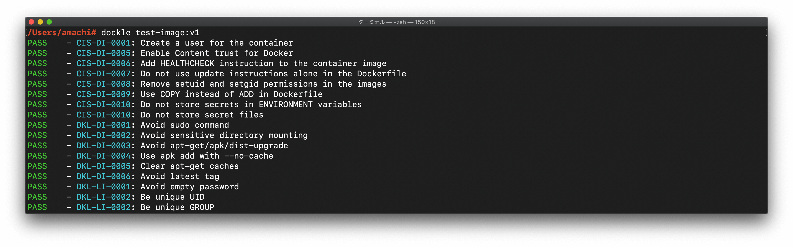
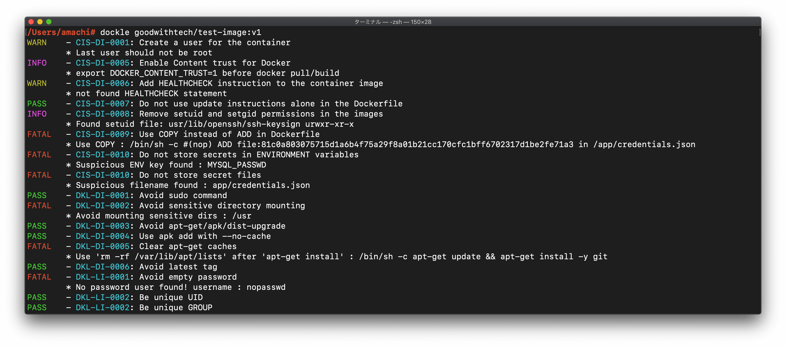

[](https://github.com/goodwithtech/dockle/releases/latest)
[](https://circleci.com/gh/goodwithtech/dockle)
[](https://goreportcard.com/report/github.com/goodwithtech/dockle)
[](https://www.gnu.org/licenses/agpl-3.0)

> Dockle - Container Image Linter for Security, Helping build the Best-Practice Docker Image, Easy to start

`Dockle` helps you:

1. Build [Best Practice](https://docs.docker.com/develop/develop-images/dockerfile_best-practices/) Docker images
2. Build secure Docker images
    - Checkpoints includes [CIS Benchmarks](https://www.cisecurity.org/cis-benchmarks/)

To check your Docker image, only run:

```bash
$ brew install goodwithtech/dockle/dockle
$ dockle [YOUR_IMAGE_NAME]
```





# TOC

- [Features](#features)
- [Comparison](#comparison)
- [Installation](#installation)
  - [Homebrew (Mac OS X / Linux and WSL)](#homebrew-mac-os-x--linux-and-wsl)
  - [RHEL/CentOS](#rhelcentos)
  - [Debian/Ubuntu](#debianubuntu)
  - [Windows](#windows)
  - [Binary](#binary)
  - [From source](#from-source)
  - [Use Docker](#use-docker)
- [Quick Start](#quick-start)
  - [Basic](#basic)
  - [Docker](#docker)
- [Checkpoint Summary](#checkpoint-summary)
- [Examples](#examples)
  - [Scan an image](#scan-an-image)
  - [Scan an image file](#scan-an-image-file)
  - [Save the results as JSON](#save-the-results-as-json)
  - [Specify exit code](#specify-exit-code)
  - [Ignore the specified checkpoints](#ignore-the-specified-checkpoints)
- [Continuous Integration](#continuous-integration-ci)
  - [Travis CI](#travis-ci)
  - [CircleCI](#circleci)
  - [Authorization for Private Docker Registry](#authorization-for-private-docker-registry) 
- [Checkpoint Details](CHECKPOINT.md)
  - CIS's Docker Image Checkpoints
  - Dockle Checkpoints for Docker
  - Dockle Checkpoints for Linux
- [Credits](#credits)
- [Roadmap](#roadmap)

# Features

- Detect container's vulnerabilities
- Helping build best-practice Dockerfile
- Simple usage
  - Specify only the image name
  - See [Quick Start](#quick-start) and [Examples](#examples)
- CIS Benchmarks Support
  - High accuracy
- DevSecOps
  - Suitable for CI such as Travis CI, CircleCI, Jenkins, etc.
  - See [CI Example](#continuous-integration-ci)

# Comparison

|  | [Dockle](https://github.com/goodwithtech/dockle) | [Hadolint](https://github.com/hadolint/hadolint) | [Docker Bench for Security](https://github.com/docker/docker-bench-security) |
|--- |---:|---:|---:|
| Target |  BuildImage | Dockerfile | Host<br/>DockerDaemon<br/>BuildImage<br/>ContainerRuntime |
| How to run | Binary | Binary | ShellScript |
| Dependency | No | No | Some dependencies |
| CI Suitable | ✓ | ✓ | x |
| Purpose |SecurityAudit<br/>DockerfileLint| DockerfileLint | SecurityAudit<br/>DockerfileLint |
| Covered CIS Benchmarks (Docker Image and Build File) | 7 | 3 | 5 |

<details>
<summary>Detail of CIS Benchmark</summary>

|  | [Dockle](https://github.com/goodwithtech/dockle) | [Docker Bench for Security](https://github.com/docker/docker-bench-security) | [Hadolint](https://github.com/hadolint/hadolint) |
|---|:---:|:---:|:---:|
| 1.  Create a user for the container | ✓ | ✓ | ✓ |
| 2.  Use trusted base images for containers | - | – | - |
| 3.  Do not install unnecessary packages in the container | - | - | - |
| 4.  Scan and rebuild the images to include security patches | - | - | - |
| 5.  Enable Content trust for Docker | ✓ | ✓ | - |
| 6.  Add `HEALTHCHECK` instruction to the container image | ✓ | ✓ | - |
| 7.  Do not use `update` instructions alone in the Dockerfile | ✓ | ✓ | ✓|
| 8.  Remove `setuid` and `setgid` permissions in the images | ✓ | - | - |
| 9.  Use `COPY` instead of `ADD` in Dockerfile | ✓ | ✓ | ✓|
| 10. Do not store secrets in Dockerfiles | ✓ | - | - |
| 11. Install verified packages only | -  |  - | - |
| |7|5|3|

All checkpoints [here](#checkpoint-summary)!

</details>

# Installation

## Homebrew (Mac OS X / Linux and WSL)

You can use Homebrew on [Mac OS X](https://brew.sh/) or [Linux and WSL (Windows Subsystem for Linux)](https://docs.brew.sh/Homebrew-on-Linux).

```bash
$ brew install goodwithtech/dockle/dockle
```

## RHEL/CentOS

```bash
$ VERSION=$(
 curl --silent "https://api.github.com/repos/goodwithtech/dockle/releases/latest" | \
 grep '"tag_name":' | \
 sed -E 's/.*"v([^"]+)".*/\1/' \
) && rpm -ivh https://github.com/goodwithtech/dockle/releases/download/v${VERSION}/dockle_${VERSION}_Linux-64bit.rpm
```

## Debian/Ubuntu

```bash
$ VERSION=$(
 curl --silent "https://api.github.com/repos/goodwithtech/dockle/releases/latest" | \
 grep '"tag_name":' | \
 sed -E 's/.*"v([^"]+)".*/\1/' \
) && curl -L -o dockle.deb https://github.com/goodwithtech/dockle/releases/download/v${VERSION}/dockle_${VERSION}_Linux-64bit.deb
$ sudo dpkg -i dockle.deb && rm dockle.deb
```

## Windows

```bash
$ VERSION=$(
 curl --silent "https://api.github.com/repos/goodwithtech/dockle/releases/latest" | \
 grep '"tag_name":' | \
 sed -E 's/.*"v([^"]+)".*/\1/' \
) && curl -L -o dockle.zip https://github.com/goodwithtech/dockle/releases/download/v${VERSION}/dockle_${VERSION}_Windows-64bit.zip
$ unzip dockle.zip && rm dockle.zip
$ ./dockle.exe [IMAGE_NAME]
```

## Binary

You can get the latest version binary from [releases page](https://github.com/goodwithtech/dockle/releases/latest).

Download the archive file for your operating system/architecture. Unpack the archive, and put the binary somewhere in your `$PATH` (on UNIX-y systems, `/usr/local/bin` or the like).

- NOTE: Make sure that it's execution bits turned on. (`chmod +x dockle`)

## From source

```bash
$ GO111MODULE=off go get github.com/goodwithtech/dockle/cmd/dockle
$ cd $GOPATH/src/github.com/goodwithtech/dockle && GO111MODULE=on go build -o $GOPATH/bin/dockle cmd/dockle/main.go
```

## Use Docker

There's a [`Dockle` image on Docker Hub](https://hub.docker.com/r/goodwithtech/dockle) also. You can try `dockle` before installing the command.

```
$ VERSION=$(
 curl --silent "https://api.github.com/repos/goodwithtech/dockle/releases/latest" | \
 grep '"tag_name":' | \
 sed -E 's/.*"v([^"]+)".*/\1/' \
) && docker run --rm -v /var/run/docker.sock:/var/run/docker.sock \
  goodwithtech/dockle:v${VERSION} [YOUR_IMAGE_NAME]
```

You only need `-v /var/run/docker.sock:/var/run/docker.sock` when you'd like to scan the image on your host machine.

# Quick Start

## Basic

Simply specify an image name (and a tag).

```bash
$ dockle [YOUR_IMAGE_NAME]
```

<details>
<summary>Result</summary>

```
WARN    - CIS-DI-0001: Create a user for the container
        * Last user should not be root
INFO    - CIS-DI-0005: Enable Content trust for Docker
        * export DOCKER_CONTENT_TRUST=1 before docker pull/build
WARN    - CIS-DI-0006: Add HEALTHCHECK instruction to the container image
        * not found HEALTHCHECK statement
PASS    - CIS-DI-0007: Do not use update instructions alone in the Dockerfile
PASS    - CIS-DI-0008: Remove setuid and setgid permissions in the images
PASS    - CIS-DI-0009: Use COPY instead of ADD in Dockerfile
PASS    - CIS-DI-0010: Do not store secrets in ENVIRONMENT variables
PASS    - CIS-DI-0010: Do not store secret files
PASS    - DKL-DI-0001: Avoid sudo command
PASS    - DKL-DI-0002: Avoid sensitive directory mounting
PASS    - DKL-DI-0003: Avoid apt-get/apk/dist-upgrade
PASS    - DKL-DI-0004: Use apk add with --no-cache
PASS    - DKL-DI-0005: Clear apt-get caches
WARN    - DKL-DI-0006: Avoid latest tag
        * Avoid 'latest' tag
PASS    - DKL-LI-0001: Avoid empty password
PASS    - DKL-LI-0002: Be unique UID
PASS    - DKL-LI-0002: Be unique GROUP
```

</details>

## Docker

Also, you can use Docker to use `dockle` command as follow.

```bash
$ export DOCKLE_LATEST=$(
 curl --silent "https://api.github.com/repos/goodwithtech/dockle/releases/latest" | \
 grep '"tag_name":' | \
 sed -E 's/.*"v([^"]+)".*/\1/' \
)
$ docker run --rm goodwithtech/dockle:v${DOCKLE_LATEST} [YOUR_IMAGE_NAME]
```

- If you'd like to scan the image on your host machine, you need to mount `docker.sock`.

    ```bash
    $ docker run --rm -v /var/run/docker.sock:/var/run/docker.sock ...
    ```

# Checkpoint Summary

- Details of each checkpoint see [CHECKPOINT.md](CHECKPOINT.md)

| CODE | DESCRIPTION | LEVEL[※](#level) |
|---|---|:---:|
| | [CIS's Docker Image Checkpoints](CHECKPOINT.md#docker-image-checkpoints) | |
| [CIS-DI-0001](CHECKPOINT.md#cis-di-0001-create-a-user-for-the-container) | Create a user for the container | WARN |
| [CIS-DI-0002](CHECKPOINT.md#cis-di-0002-use-trusted-base-images-for-containers) | Use trusted base images for containers | FATAL
| [CIS-DI-0003](CHECKPOINT.md#cis-di-0003-do-not-install-unnecessary-packages-in-the-container) | Do not install unnecessary packages in the container | FATAL
| [CIS-DI-0004](CHECKPOINT.md#cis-di-0004-scan-and-rebuild-the-images-to-include-security-patches) | Scan and rebuild the images to include security patches | FATAL
| [CIS-DI-0005](CHECKPOINT.md#cis-di-0005-enable-content-trust-for-docker) | Do not install unnecessary packages in the container | FATAL
| [CIS-DI-0006](CHECKPOINT.md#cis-di-0006-add-healthcheck-instruction-to-the-container-image) | Add `HEALTHCHECK` instruction to the container image | WARN
| [CIS-DI-0007](CHECKPOINT.md#cis-di-0007-do-not-use-update-instructions-alone-in-the-dockerfile) | Do not use `update` instructions alone in the Dockerfile | FATAL
| [CIS-DI-0008](CHECKPOINT.md#cis-di-0008-remove-setuid-and-setgid-permissions-in-the-images) | Remove `setuid` and `setgid` permissions in the images | INFO
| [CIS-DI-0009](CHECKPOINT.md#cis-di-0009-use-copy-instead-of-add-in-dockerfile) | Use `COPY` instead of `ADD` in Dockerfile | FATAL
| [CIS-DI-0010](CHECKPOINT.md#cis-di-0010-do-not-store-secrets-in-dockerfiles) | Do not store secrets in Dockerfiles | FATAL
| [CIS-DI-0011](CHECKPOINT.md#cis-di-0011-install-verified-packages-only) | Install verified packages only | INFO
|| [Dockle Checkpoints for Docker](CHECKPOINT.md#dockle-checkpoints-for-docker) |
| [DKL-DI-0001](CHECKPOINT.md#dkl-di-0001-avoid-sudo-command) | Avoid `sudo` command | FATAL
| [DKL-DI-0002](CHECKPOINT.md#dkl-di-0002-avoid-sensitive-directory-mounting) | Avoid sensitive directory mounting | FATAL
| [DKL-DI-0003](CHECKPOINT.md#dkl-di-0003-avoid-apt-get-upgrade-apk-upgrade-dist-upgrade) | Avoid `apt-get upgrade`, `apk upgrade`, `dist-upgrade` | FATAL
| [DKL-DI-0004](CHECKPOINT.md#dkl-di-0004-use-apk-add-with---no-cache) | Use `apk add` with `--no-cache` | FATAL
| [DKL-DI-0005](CHECKPOINT.md#dkl-di-0005-clear-apt-get-caches) | Clear `apt-get` caches | FATAL
| [DKL-DI-0006](CHECKPOINT.md#dkl-di-0006-avoid-latest-tag) | Avoid `latest` tag | WARN
|| [Dockle Checkpoints for Linux](CHECKPOINT.md#dockerdockle-checkpoints-for-linux) |
| [DKL-LI-0001](CHECKPOINT.md#dkl-li-0001-avoid-empty-password) | Avoid empty password | FATAL
| [DKL-LI-0002](CHECKPOINT.md#dkl-li-0002-be-unique-uidgroups) | Be unique UID/GROUPs | FATAL

## Level

`Dockle` has 5 check levels.

| LEVEL | DESCRIPTION |
|:---:|---|
| FATAL | Be practical and prudent |
| WARN | Be practical and prudent, but limited uses (even if official images) |
| INFO | May negatively inhibit the utility or performance |
| SKIP | Not found target files |
| PASS | Not found any problems |

## Common Examples

### Scan an image

Simply specify an image name (and a tag).

```bash
$ dockle goodwithtech/test-image:v1
```

<details>
<summary>Result</summary>

```
FATAL   - CIS-DI-0001: Create a user for the container
        * Last user should not be root
WARN    - CIS-DI-0005: Enable Content trust for Docker
        * export DOCKER_CONTENT_TRUST=1 before docker pull/build
FATAL   - CIS-DI-0006: Add HEALTHCHECK instruction to the container image
        * not found HEALTHCHECK statement
FATAL   - CIS-DI-0007: Do not use update instructions alone in the Dockerfile
        * Use 'Always combine RUN 'apt-get update' with 'apt-get install' : /bin/sh -c apt-get update && apt-get install -y git
FATAL   - CIS-DI-0008: Remove setuid and setgid permissions in the images
        * Found setuid file: etc/passwd grw-r--r--
        * Found setuid file: usr/lib/openssh/ssh-keysign urwxr-xr-x
        * Found setuid file: app/hoge.txt ugrw-r--r--
        * Found setuid file: app/hoge.txt ugrw-r--r--
        * Found setuid file: etc/shadow urw-r-----
FATAL   - CIS-DI-0009: Use COPY instead of ADD in Dockerfile
        * Use COPY : /bin/sh -c #(nop) ADD file:81c0a803075715d1a6b4f75a29f8a01b21cc170cfc1bff6702317d1be2fe71a3 in /app/credentials.json
FATAL   - CIS-DI-0010: Do not store secrets in ENVIRONMENT variables
        * Suspicious ENV key found : MYSQL_PASSWD
FATAL   - CIS-DI-0010: Do not store secret files
        * Suspicious filename found : app/credentials.json
PASS    - DKL-DI-0001: Avoid sudo command
FATAL   - DKL-DI-0002: Avoid sensitive directory mounting
        * Avoid mounting sensitive dirs : /usr
PASS    - DKL-DI-0003: Avoid apt-get/apk/dist-upgrade
PASS    - DKL-DI-0004: Use apk add with --no-cache
FATAL   - DKL-DI-0005: Clear apt-get caches
        * Use 'apt-get clean && rm -rf /var/lib/apt/lists/*' : /bin/sh -c apt-get update && apt-get install -y git
PASS    - DKL-DI-0006: Avoid latest tag
FATAL   - DKL-LI-0001: Avoid empty password
        * No password user found! username : nopasswd
PASS    - DKL-LI-0002: Be unique UID
PASS    - DKL-LI-0002: Be unique GROUP
```
</details>

### Scan an image file

```bash
$ docker save alpine:latest -o alpine.tar
$ dockle --input alpine.tar
```

### Get or Save the results as JSON

```bash
$ dockle -f json goodwithtech/test-image:v1
$ dockle -f json -o results.json goodwithtech/test-image:v1
```

<details>
<summary>Result</summary>

```json
{
  "summary": {
    "fatal": 6,
    "warn": 2,
    "info": 2,
    "pass": 7
  },
  "details": [
    {
      "code": "CIS-DI-0001",
      "title": "Create a user for the container",
      "level": "WARN",
      "alerts": [
        "Last user should not be root"
      ]
    },
    {
      "code": "CIS-DI-0005",
      "title": "Enable Content trust for Docker",
      "level": "INFO",
      "alerts": [
        "export DOCKER_CONTENT_TRUST=1 before docker pull/build"
      ]
    },
    {
      "code": "CIS-DI-0006",
      "title": "Add HEALTHCHECK instruction to the container image",
      "level": "WARN",
      "alerts": [
        "not found HEALTHCHECK statement"
      ]
    },
    {
      "code": "CIS-DI-0008",
      "title": "Remove setuid and setgid permissions in the images",
      "level": "INFO",
      "alerts": [
        "Found setuid file: usr/lib/openssh/ssh-keysign urwxr-xr-x"
      ]
    },
    {
      "code": "CIS-DI-0009",
      "title": "Use COPY instead of ADD in Dockerfile",
      "level": "FATAL",
      "alerts": [
        "Use COPY : /bin/sh -c #(nop) ADD file:81c0a803075715d1a6b4f75a29f8a01b21cc170cfc1bff6702317d1be2fe71a3 in /app/credentials.json "
      ]
    },
    {
      "code": "CIS-DI-0010",
      "title": "Do not store secrets in ENVIRONMENT variables",
      "level": "FATAL",
      "alerts": [
        "Suspicious ENV key found : MYSQL_PASSWD"
      ]
    },
    {
      "code": "CIS-DI-0010",
      "title": "Do not store secret files",
      "level": "FATAL",
      "alerts": [
        "Suspicious filename found : app/credentials.json "
      ]
    },
    {
      "code": "DKL-DI-0002",
      "title": "Avoid sensitive directory mounting",
      "level": "FATAL",
      "alerts": [
        "Avoid mounting sensitive dirs : /usr"
      ]
    },
    {
      "code": "DKL-DI-0005",
      "title": "Clear apt-get caches",
      "level": "FATAL",
      "alerts": [
        "Use 'rm -rf /var/lib/apt/lists' after 'apt-get install' : /bin/sh -c apt-get update \u0026\u0026 apt-get install -y git"
      ]
    },
    {
      "code": "DKL-LI-0001",
      "title": "Avoid empty password",
      "level": "FATAL",
      "alerts": [
        "No password user found! username : nopasswd"
      ]
    }
  ]
}
```

</details>

### Specify exit code

By default, `Dockle` exits with code `0` even if there are some problems.

Use the `--exit-code` option to exit with a non-zero exit code if any alert were found.

```bash
$ dockle  --exit-code 1 [IMAGE_NAME]
```

### Ignore the specified checkpoints

The `--ignore, -i` option can ignore specified checkpoints.

```bash
$ dockle -i CIS-DI-0001 -i DKL-DI-0006 [IMAGE_NAME]
```

Or, use `.dockleignore` file.

```bash
$ cat .dockleignore
# set root to default user because we want to run nginx
CIS-DI-0001
# Use latest tag because to check the image inside only
DKL-DI-0006
```

## Continuous Integration (CI)

You can scan your built image with `Dockle` in Travis CI/CircleCI.

In these examples, the test will fail with if any warnings were found.

Though, you can ignore the specified target checkpoints by using `.dockleignore` file.

Or, if you just want the results to display and not let the test fail for this, specify `--exit-code` to `0` in `dockle` command.

### Travis CI

<details>
<summary>.travis.yml</summary>

```yaml
services:
  - docker

env:
  global:
    - COMMIT=${TRAVIS_COMMIT::8}

before_install:
  - docker build -t dockle-ci-test:${COMMIT} .
  - export VERSION=$(curl --silent "https://api.github.com/repos/goodwithtech/dockle/releases/latest" | grep '"tag_name":' | sed -E 's/.*"v([^"]+)".*/\1/')
  - wget https://github.com/goodwithtech/dockle/releases/download/v${VERSION}/dockle_${VERSION}_Linux-64bit.tar.gz
  - tar zxvf dockle_${VERSION}_Linux-64bit.tar.gz
script:
  - ./dockle dockle-ci-test:${COMMIT}
  - ./dockle --exit-code 1 dockle-ci-test:${COMMIT}
```
</details>

- Example: https://travis-ci.org/goodwithtech/dockle-ci-test
- Repository: https://github.com/goodwithtech/dockle-ci-test

### CircleCI

<details>
<summary>.circleci/config.yml</summary>

```yaml
jobs:
  build:
    docker:
      - image: docker:18.09-git
    steps:
      - checkout
      - setup_remote_docker
      - run:
          name: Build image
          command: docker build -t dockle-ci-test:${CIRCLE_SHA1} .
      - run:
          name: Install dockle
          command: |
            apk add --update curl
            VERSION=$(
                curl --silent "https://api.github.com/repos/goodwithtech/dockle/releases/latest" | \
                grep '"tag_name":' | \
                sed -E 's/.*"v([^"]+)".*/\1/'
            )
            wget https://github.com/goodwithtech/dockle/releases/download/v${VERSION}/dockle_${VERSION}_Linux-64bit.tar.gz
            tar zxvf dockle_${VERSION}_Linux-64bit.tar.gz
            mv dockle /usr/local/bin
      - run:
          name: Scan the local image with dockle
          command: dockle --exit-code 1 dockle-ci-test:${CIRCLE_SHA1}
workflows:
  version: 2
  release:
    jobs:
      - build
```
</details>

- Example: https://circleci.com/gh/goodwithtech/dockle-ci-test
- Repository: https://github.com/goodwithtech/dockle-ci-test

## Authorization for Private Docker Registry

`Dockle` can download images from a private registry, without installing `Docker` or any other 3rd party tools. It's designed so for ease of use in a CI process.

All you have to do is: install `Dockle` and set ENVIRONMENT variables.

- NOTE: I don't recommend using ENV vars in your local machine.

### Docker Hub

To download the private repository from Docker Hub, you need to set `DOCKLE_AUTH_URL`, `DOCKLE_USERNAME` and `DOCKLE_PASSWORD` ENV vars.


```bash
export DOCKLE_AUTH_URL=https://registry.hub.docker.com
export DOCKLE_USERNAME={DOCKERHUB_USERNAME}
export DOCKLE_PASSWORD={DOCKERHUB_PASSWORD}
```

- NOTE: You don't need to set ENV vars when downloading from the public repository.

### Amazon ECR (Elastic Container Registry)

`Dockle` uses the AWS SDK. You don't need to install `aws` CLI tool.

Use [AWS CLI's ENVIRONMENT variables](https://docs.aws.amazon.com/cli/latest/userguide/cli-configure-envvars.html).

```bash
export AWS_ACCESS_KEY_ID={AWS ACCESS KEY}
export AWS_SECRET_ACCESS_KEY={SECRET KEY}
export AWS_DEFAULT_REGION={AWS REGION}
```

### GCR (Google Container Registry)

`Dockle` uses the Google Cloud SDK. So, you don't need to install `gcloud` command.

If you'd like to use the target project's repository, you can settle via `GOOGLE_APPLICATION_CREDENTIAL`.

```bash
# must set DOCKLE_USERNAME empty char
export GOOGLE_APPLICATION_CREDENTIALS=/path/to/credential.json
```

### Self Hosted Registry (BasicAuth)

BasicAuth server needs `DOCKLE_USERNAME` and `DOCKLE_PASSWORD`.

```bash
export DOCKLE_USERNAME={USERNAME}
export DOCKLE_PASSWORD={PASSWORD}

# if you'd like to use 80 port, use NonSSL
export DOCKLE_NON_SSL=true
```

# Credits

Special Thanks to [@knqyf263](https://github.com/knqyf263) (Teppei Fukuda) and [Trivy](https://github.com/knqyf263/trivy)

# License

- AGPLv3

# Author

[@tomoyamachi](https://github.com/tomoyamachi) (Tomoya Amachi)

# Roadmap

- [x] JSON output
- [ ] Check php.ini file
- [ ] Check nginx.conf file
- [ ] create CI badges
- Check /etc/hosts
  - [ ] duplicates
  - [ ] hostname
  - [ ] localhost
- Packages
  - [ ] Package managers
- File Permissions
  - [ ] Insecure permission
- Image Size
  - [ ] check large size container

## if running docker daemon...

- Networking
  - [ ] `docker port container` if docker running
  - [ ] by file
    - `/proc/1/net/tcp` : openning port (if running)
- Volume mount
  - dangerous mount
    - `/boot`, `/dev`, `/etc`, `/lib`
