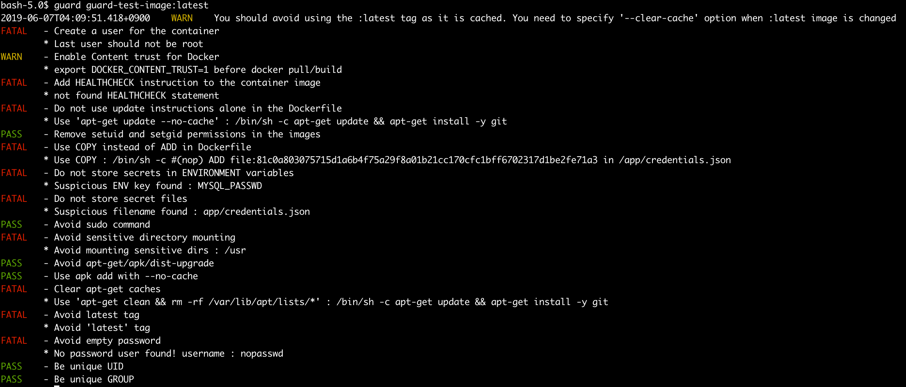
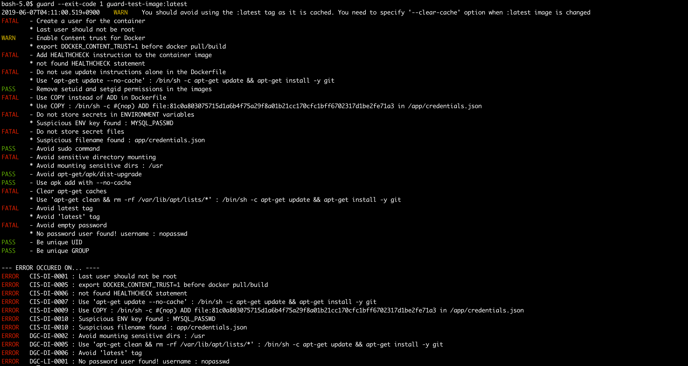

[](https://github.com/goodwithtech/docker-guard/releases/latest)
[](https://circleci.com/gh/goodwithtech/docker-guard)
[](https://goreportcard.com/report/github.com/goodwithtech/docker-guard)
[](https://www.gnu.org/licenses/agpl-3.0)

`DockerGuard` is Security auditing tool that helps you
1) Build secure Docker images
    - Checkpoints includes [CIS Benchmarks](https://www.cisecurity.org/cis-benchmarks/)
2) Build [Best Practice](https://docs.docker.com/develop/develop-images/dockerfile_best-practices/) Docker images

You can check a docker image only run... 
```bash
guard [YOUR_IMAGE_NAME]
``` 






# TOC

- [Comparison](#comparison-use-cis-benchmark-checkpoints)
- [Installation](#installation)
  - [RHEL/CentOS](#rhelcentos)
  - [Debian/Ubuntu](#debianubuntu)
  - [Mac OS X / Homebrew](#mac-os-x--homebrew)
  - [Binary (Including Windows)](#binary-including-windows)
  - [From source](#from-source)
- [Checkpoint Summary](#checkpoint-summary)
- [Quick Start](#quick-start)
  - [Basic](#basic)
  - [Docker](#docker)
- [Examples](#examples)
  - [Scan an image](#scan-an-image)
  - [Scan an image file](#scan-an-image-file)
  - [Specify exit code](#specify-exit-code)
  - [Ignore the specified checkpoints](#ignore-the-specified-checkpoints-only-work-with---exit-code)
  - [Clear image caches](#clear-image-caches)
- [Continuous Integration](#continuous-integration-ci)
  - [Travis CI](#travis-ci)
  - [CircleCI](#circleci)
  - [Authorization for Private Docker Registry](#authorization-for-private-docker-registry)
- [Checkpoint Detail](#checkpoint-detail)
  - [CIS's Docker Image Checkpoints](#docker-image-checkpoints)
  - [DockerGuard Checkpoints for Docker](#dockerguard-checkpoints-for-docker)
  - [DockerGuard Checkpoints for Linux](#dockerguard-checkpoints-for-linux)
- [Roadmap](#roadmap)


# Comparison (use CIS Benchmark checkpoints)

|  | [DockerGuard](https://github.com/goodwithtech/docker-guard) | [Docker Bench for Security](https://github.com/docker/docker-bench-security) | [hadolint](https://github.com/hadolint/hadolint) | 
|---|:---:|:---:|:---:|
| 1.  Create a user for the container | ✓ | ✓ | ✓ |
| 2.  Use trusted base images for containers | - | – | - |
| 3.  Do not install unnecessary packages in the container | - | - | - |
| 4.  Scan and rebuild the images to include security patches | - | - | - |  
| 5.  Enable Content trust for Docker | ✓ | ✓ | - |
| 6.  Add HEALTHCHECK instruction to the container image | ✓ | ✓ | - |
| 7.  Do not use update instructions alone in the Dockerfile | ✓ | ✓ | ✓|
| 8.  Remove setuid and setgid permissions in the images | - | - | - |
| 9.  Use COPY instead of ADD in Dockerfile | ✓ | ✓ | ✓|
| 10. Do not store secrets in Dockerfiles | ✓ | - | - |
| 11. Install verified packages only | -  |  - | - |
| |6|5|3|

All checkpoints [here](#checkpoint-summary)!

# Installation

## RHEL/CentOS

```
$ rpm -ivh https://github.com/goodwithtech/docker-guard/releases/download/v0.0.14/guard_0.0.14_Linux-64bit.rpm
```

## Debian/Ubuntu

```bash
$ wget https://github.com/goodwithtech/docker-guard/releases/download/v0.0.14/guard_0.0.14_Linux-64bit.deb
$ sudo dpkg -i guard_0.0.14_Linux-64bit.deb
```

## Mac OS X / Homebrew

You can use homebrew on Mac OS.

```
$ brew tap goodwithtech/guard 
$ brew install goodwithtech/guard/guard
```

## Binary (Including Windows)

Get the latest version from [this page](https://github.com/goodwithtech/docker-guard/releases/latest), and download the archive file for your operating system/architecture. Unpack the archive, and put the binary somewhere in your `$PATH` (on UNIX-y systems, /usr/local/bin or the like). Make sure it has execution bits turned on.


## From source

```sh
$ go get -u github.com/goodwithtech/docker-guard
```

# Quick Start

## Basic

Simply specify an image name (and a tag).

```bash
$ guard [YOUR_IMAGE_NAME]
```

<details>
<summary>Result</summary>

```
FATAL   - Create a user for the container
        * Last user should not be root
WARN    - Enable Content trust for Docker
        * export DOCKER_CONTENT_TRUST=1 before docker pull/build
FATAL   - Add HEALTHCHECK instruction to the container image
        * not found HEALTHCHECK statement
FATAL   - Do not use update instructions alone in the Dockerfile
        * Use 'apt-get update --no-cache' : /bin/sh -c apt-get update && apt-get install -y git
PASS    - Remove setuid and setgid permissions in the images
FATAL   - Use COPY instead of ADD in Dockerfile
        * Use COPY : /bin/sh -c #(nop) ADD file:81c0a803075715d1a6b4f75a29f8a01b21cc170cfc1bff6702317d1be2fe71a3 in /app/credentials.json
FATAL   - Do not store secrets in ENVIRONMENT variables
        * Suspicious ENV key found : MYSQL_PASSWD
FATAL   - Do not store secret files
        * Suspicious filename found : app/credentials.json
PASS    - Avoid sudo command
FATAL   - Avoid sensitive directory mounting
        * Avoid mounting sensitive dirs : /usr
PASS    - Avoid apt-get/apk/dist-upgrade
PASS    - Use apk add with --no-cache
FATAL   - Clear apt-get caches
        * Use 'apt-get clean && rm -rf /var/lib/apt/lists/*' : /bin/sh -c apt-get update && apt-get install -y git
PASS    - Avoid latest tag
FATAL   - Avoid empty password
        * No password user found! username : nopasswd
PASS    - Be unique UID
PASS    - Be unique GROUP
```
</details>

## Docker

Replace [YOUR_CACHE_DIR] with the cache directory on your machine.

```
$ docker run --rm -v [YOUR_CACHE_DIR]:/root/.cache/ goodwithtech/guard [YOUR_IMAGE_NAME]
```

Example for macOS:

```
$ docker run --rm -v $HOME/Library/Caches:/root/.cache/ goodwithtech/guard [YOUR_IMAGE_NAME]
```

If you would like to scan the image on your host machine, you need to mount `docker.sock`.

```
$ docker run --rm -v /var/run/docker.sock:/var/run/docker.sock ...
```

Please re-pull latest `goodwithtech/guard` if an error occured.

# Checkpoint Summary

| CODE | DESCRIPTION | LEVEL[※](#level) |
|---|---|:---:|
| | [CIS's Docker Image Checkpoints](#docker-image-checkpoints) | |
| [CIS-DI-0001](#cis-di-0001-create-a-user-for-the-container) | Create a user for the container | FATAL |
| [CIS-DI-0002](#cis-di-0002-use-trusted-base-images-for-containers) | Use trusted base images for containers | FATAL
| [CIS-DI-0003](#cis-di-0003-do-not-install-unnecessary-packages-in-the-container) | Do not install unnecessary packages in the container | FATAL
| [CIS-DI-0004](#cis-di-0004-scan-and-rebuild-the-images-to-include-security-patches) | Scan and rebuild the images to include security patches | FATAL
| [CIS-DI-0006](#cis-di-0006-add-healthcheck-instruction-to-the-container-image) | Add HEALTHCHECK instruction to the container image | FATAL
| [CIS-DI-0007](#cis-di-0007-do-not-use-update-instructions-alone-in-the-dockerfile) | Do not use update instructions alone in the Dockerfile | FATAL
| [CIS-DI-0008](#cis-di-0008-remove-setuid-and-setgid-permissions-in-the-images) | Remove setuid and setgid permissions in the images | WARN
| [CIS-DI-0009](#cis-di-0009-use-copy-instead-of-add-in-dockerfile) | Use COPY instead of ADD in Dockerfile | FATAL
| [CIS-DI-0010](#cis-di-0010-do-not-store-secrets-in-dockerfiles) | Do not store secrets in Dockerfiles | FATAL
| [CIS-DI-0011](#cis-di-0011-install-verified-packages-only) | Install verified packages only | WARN
|| [DockerGuard Checkpoints for Docker](#dockerguard-checkpoints-for-docker) |
| [DGC-DI-0001](#dgc-di-0001-avoid-sudo-command) | Avoid `sudo` command | FATAL
| [DGC-DI-0002](#dgc-di-0002-avoid-sensitive-directory-mounting) | Avoid sensitive directory mounting | FATAL
| [DGC-DI-0003](#dgc-di-0003-avoid-apt-get-upgrade-apk-upgrade-dist-upgrade) | Avoid `apt-get upgrade`, `apk upgrade`, `dist-upgrade` | FATAL
| [DGC-DI-0004](#dgc-di-0004-use-apk-add-with---no-cache) | Use apk add with `--no-cache` | FATAL
| [DGC-DI-0005](#dgc-di-0005-clear-apt-get-caches) | Clear apt-get caches | FATAL
| [DGC-DI-0006](#dgc-di-0006-avoid-latest-tag) | Avoid `latest` tag | WARN
|| [DockerGuard Checkpoints for Linux](#dockerguard-checkpoints-for-linux) |
| [DGC-LI-0001](#dgc-li-0001-avoid-empty-password) | Avoid empty password | FATAL
| [DGC-LI-0002](#dgc-li-0002-be-unique-uidgroups) | Be unique UID/GROUPs | FATAL

#### Level

`DockerGuard` has 3 check levels

| LEVEL | DESCRIPTION |
|:---:|---|
| FATAL | Be practical and prudent |
| WARN | May negatively inhibit the utility or performance, but better to security |
| INFO | For Your Information |

# Examples

## Scan an image

Simply specify an image name (and a tag).

```bash
$ guard goodwithtech/test-image:v1
```
<details>
<summary>Result</summary>

```
FATAL   - Create a user for the container
        * Last user should not be root
WARN    - Enable Content trust for Docker
        * export DOCKER_CONTENT_TRUST=1 before docker pull/build
FATAL   - Add HEALTHCHECK instruction to the container image
        * not found HEALTHCHECK statement
FATAL   - Do not use update instructions alone in the Dockerfile
        * Use 'apt-get update --no-cache' : /bin/sh -c apt-get update && apt-get install -y git
PASS    - Remove setuid and setgid permissions in the images
FATAL   - Use COPY instead of ADD in Dockerfile
        * Use COPY : /bin/sh -c #(nop) ADD file:81c0a803075715d1a6b4f75a29f8a01b21cc170cfc1bff6702317d1be2fe71a3 in /app/credentials.json
FATAL   - Do not store secrets in ENVIRONMENT variables
        * Suspicious ENV key found : MYSQL_PASSWD
FATAL   - Do not store secret files
        * Suspicious filename found : app/credentials.json
PASS    - Avoid sudo command
FATAL   - Avoid sensitive directory mounting
        * Avoid mounting sensitive dirs : /usr
PASS    - Avoid apt-get/apk/dist-upgrade
PASS    - Use apk add with --no-cache
FATAL   - Clear apt-get caches
        * Use 'apt-get clean && rm -rf /var/lib/apt/lists/*' : /bin/sh -c apt-get update && apt-get install -y git
PASS    - Avoid latest tag
FATAL   - Avoid empty password
        * No password user found! username : nopasswd
PASS    - Be unique UID
PASS    - Be unique GROUP
```
</details>

## Scan an image file

```bash
$ docker save alpine:latest -o alpine.tar
$ guard --input alpine.tar
```

## Specify exit code
By default, `DockerGuard` exits with code 0 even if there are some problems.
Use the --exit-code option if you want to exit with a non-zero exit code.

```bash
$ guard  -exist-code 1 [IMAGE_NAME]
```

<details>
<summary>Result</summary>

```
FATAL   - Create a user for the container
        * Last user should not be root
WARN    - Enable Content trust for Docker
        * export DOCKER_CONTENT_TRUST=1 before docker pull/build
FATAL   - Add HEALTHCHECK instruction to the container image
        * not found HEALTHCHECK statement
FATAL   - Do not use update instructions alone in the Dockerfile
        * Use 'apt-get update --no-cache' : /bin/sh -c apt-get update && apt-get install -y git
PASS    - Remove setuid and setgid permissions in the images
FATAL   - Use COPY instead of ADD in Dockerfile
        * Use COPY : /bin/sh -c #(nop) ADD file:81c0a803075715d1a6b4f75a29f8a01b21cc170cfc1bff6702317d1be2fe71a3 in /app/credentials.json
FATAL   - Do not store secrets in ENVIRONMENT variables
        * Suspicious ENV key found : MYSQL_PASSWD
FATAL   - Do not store secret files
        * Suspicious filename found : app/credentials.json
PASS    - Avoid sudo command
FATAL   - Avoid sensitive directory mounting
        * Avoid mounting sensitive dirs : /usr
PASS    - Avoid apt-get/apk/dist-upgrade
PASS    - Use apk add with --no-cache
FATAL   - Clear apt-get caches
        * Use 'apt-get clean && rm -rf /var/lib/apt/lists/*' : /bin/sh -c apt-get update && apt-get install -y git
PASS    - Avoid latest tag
FATAL   - Avoid empty password
        * No password user found! username : nopasswd
PASS    - Be unique UID
PASS    - Be unique GROUP

--- ERROR OCCURED ON... ----
ERROR   CIS-DI-0005 : export DOCKER_CONTENT_TRUST=1 before docker pull/build
ERROR   CIS-DI-0006 : not found HEALTHCHECK statement
ERROR   CIS-DI-0007 : Use 'apt-get update --no-cache' : /bin/sh -c apt-get update && apt-get install -y git
ERROR   CIS-DI-0009 : Use COPY : /bin/sh -c #(nop) ADD file:81c0a803075715d1a6b4f75a29f8a01b21cc170cfc1bff6702317d1be2fe71a3 in /app/credentials.json
ERROR   CIS-DI-0010 : Suspicious ENV key found : MYSQL_PASSWD
ERROR   CIS-DI-0010 : Suspicious filename found : app/credentials.json
ERROR   DGC-DI-0002 : Avoid mounting sensitive dirs : /usr
ERROR   DGC-DI-0005 : Use 'apt-get clean && rm -rf /var/lib/apt/lists/*' : /bin/sh -c apt-get update && apt-get install -y git
ERROR   DGC-LI-0001 : No password user found! username : nopasswd

```
</details>


## Ignore the specified checkpoints (only work with --exit-code)

Use `.guardignore`.

```bash
$ cat .guardignore
# set root to default user because we want to run nginx
CIS-DI-0001
# Use latest tag because only check for image inside
DGC-DI-0006
```

### Clear image caches

The `--clear-cache` option removes image caches. This option is useful if the image which has the same tag is updated (such as when using `latest` tag).

```
$ guard --clear-cache python:3.7
```

# Continuous Integration (CI)

Scan your image built in Travis CI/CircleCI. 
The test will fail with if a error is found.
You can skip target checkpoint if you use `.guardignore`.
 
When you don't want to fail the test, specify `--exit-code 0`.


## Travis CI

```yaml
services:
  - docker

env:
  global:
    - COMMIT=${TRAVIS_COMMIT::8}

before_install:
  - docker build -t guard-ci-test:${COMMIT} .
  - export VERSION=$(curl --silent "https://api.github.com/repos/goodwithtech/docker-guard/releases/latest" | grep '"tag_name":' | sed -E 's/.*"v([^"]+)".*/\1/')
  - wget https://github.com/goodwithtech/docker-guard/releases/download/v${VERSION}/guard_${VERSION}_Linux-64bit.tar.gz
  - tar zxvf guard_${VERSION}_Linux-64bit.tar.gz
script:
  - ./guard guard-ci-test:${COMMIT}
  - ./guard --exit-code 1 guard-ci-test:${COMMIT}
```

Example: https://travis-ci.org/goodwithtech/guard-ci-test<br/>
Repository: https://github.com/goodwithtech/guard-ci-test

## CircleCI

```yaml
jobs:
  build:
    docker:
      - image: docker:18.09-git
    steps:
      - checkout
      - setup_remote_docker
      - run:
          name: Build image
          command: docker build -t guard-ci-test:${CIRCLE_SHA1} .
      - run:
          name: Install guard
          command: |
            apk add --update curl
            VERSION=$(
                curl --silent "https://api.github.com/repos/goodwithtech/docker-guard/releases/latest" | \
                grep '"tag_name":' | \
                sed -E 's/.*"v([^"]+)".*/\1/'
            )

            wget https://github.com/goodwithtech/docker-guard/releases/download/v${VERSION}/guard_${VERSION}_Linux-64bit.tar.gz
            tar zxvf guard_${VERSION}_Linux-64bit.tar.gz
            mv guard /usr/local/bin
      - run:
          name: Scan the local image with guard
          command: guard --exit-code 1 guard-ci-test:${CIRCLE_SHA1}
workflows:
  version: 2
  release:
    jobs:
      - build
```

Example : https://circleci.com/gh/goodwithtech/guard-ci-test<br/>
Repository: https://github.com/goodwithtech/guard-ci-test

## Authorization for Private Docker Registry

`DockerGuard` can download images from private registry, without installing `Docker` and any 3rd party tools.
That's because it's easy to run in a CI process.

All you have to do is install `DockerGuard` and set ENVIRONMENT variables.
But, I can't recommend using ENV vars in your local machine to you.

### Docker Hub

Docker Hub needs `DOCKER_GUARD_AUTH_URL`, `DOCKER_GUARD_USERNAME` and `DOCKER_GUARD_PASSWORD`.
You don't need to set ENV vars when download from public repository.

```bash
export DOCKER_GUARD_AUTH_URL=https://registry.hub.docker.com
export DOCKER_GUARD_USERNAME={DOCKERHUB_USERNAME}
export DOCKER_GUARD_PASSWORD={DOCKERHUB_PASSWORD}
```

### Amazon ECR (Elastic Container Registry)

`DockerGuard` uses AWS SDK. You don't need to install `aws` CLI tool.
You can use [AWS CLI's ENV Vars](https://docs.aws.amazon.com/cli/latest/userguide/cli-configure-envvars.html).

### GCR (Google Container Registry)

`DockerGuard` uses Google Cloud SDK. You don't need to install `gcloud` command.

If you want to use target project's repository, you can settle via `GOOGLE_APPLICATION_CREDENTIAL`. 
```bash
# must set DOCKER_GUARD_USERNAME empty char
export GOOGLE_APPLICATION_CREDENTIALS=/path/to/credential.json
```

### Self Hosted Registry (BasicAuth)

BasicAuth server needs `DOCKER_GUARD_USERNAME` and `DOCKER_GUARD_PASSWORD`.

```bash
export DOCKER_GUARD_USERNAME={USERNAME}
export DOCKER_GUARD_PASSWORD={PASSWORD}

# if you want to use 80 port, use NonSSL
export DOCKER_GUARD_NON_SSL=true
```

# Checkpoint Detail

## Docker Image Checkpoints

These checkpoints refered to [CIS Docker 1.13.0 Benchmark v1.0.0](https://www.cisecurity.org/benchmark/docker/).

### CIS-DI-0001: Create a user for the container

> Create a non-root user for the container in the Dockerfile for the container image. 

```
# Dockerfile
RUN useradd -d /home/username -m -s /bin/bash username
USER username
```


### CIS-DI-0002: Use trusted base images for containers

Not supported.
Please check with [Trivy](https://github.com/knqyf263/trivy).

### CIS-DI-0003: Do not install unnecessary packages in the container

Not supported yet.

### CIS-DI-0004: Scan and rebuild the images to include security patches

Not supported.
Please check with [Trivy](https://github.com/knqyf263/trivy).

### CIS-DI-0005: Enable Content trust for Docker

> Content trust is disabled by default. You should enable it.

```bash
$ export DOCKER_CONTENT_TRUST=1 
```

https://docs.docker.com/engine/security/trust/content_trust/#about-docker-content-trust-dct

> Docker Content Trust (DCT) provides the ability to use digital signatures for data sent to and received from remote Docker registries.
> Engine Signature Verification prevents the following:
> - `$ docker container run` of an unsigned image.
> - `$ docker pull` of an unsigned image.
> - `$ docker build` where the FROM image is not signed or is not scratch.


### CIS-DI-0006: Add HEALTHCHECK instruction to the container image

> Add `HEALTHCHECK` instruction in your docker container images to perform the health check on running containers.

```
# Dockerfile
HEALTHCHECK --interval=5m --timeout=3s \
  CMD curl -f http://localhost/ || exit 1
```

### CIS-DI-0007: Do not use update instructions alone in the Dockerfile

> Do not use update instructions such as apt-get update alone or in a single line in the Dockerfile.

```bash
RUN apt-get update --no-cache
```

### CIS-DI-0008: Remove setuid and setgid permissions in the images

Not supported yet.
I will support it soon!

> Removing setuid and setgid permissions in the images would prevent privilege escalation attacks in the containers.

### CIS-DI-0009: Use COPY instead of ADD in Dockerfile

> Use COPY instruction instead of ADD instruction in the Dockerfile.

```
# Dockerfile
ADD test.json /app/test.json
↓
COPY test.json /app/test.json
```

### CIS-DI-0010: Do not store secrets in Dockerfiles

> Do not store any secrets in Dockerfiles.

`DockerGuard` checks ENVIRONMENT variables and credential files.

### CIS-DI-0011: Install verified packages only

Not supported.
It's better to use [Trivy](https://github.com/knqyf263/trivy).

## DockerGuard Checkpoints for Docker

These checkpoints refered to [Docker Best Practice](https://docs.docker.com/develop/develop-images/dockerfile_best-practices/) and so on.

### DGC-DI-0001: Avoid `sudo` command

https://docs.docker.com/develop/develop-images/dockerfile_best-practices/#user
> Avoid installing or using sudo as it has unpredictable TTY and signal-forwarding behavior that can cause problems.

### DGC-DI-0002: Avoid sensitive directory mounting

A volume mount makes weakpoints. 
This depends on mounting volumes.
Currently, `DockerGuard` checks following directories.

`/boot`,`/dev`,`/etc`,`/lib`,`/proc`,`/sys`, `/usr`

`guard` only checks `VOLUME` statements. We can't check `docker run -v /lib:/lib ...`.


### DGC-DI-0003: Avoid `apt-get upgrade`, `apk upgrade`, `dist-upgrade`

https://docs.docker.com/develop/develop-images/dockerfile_best-practices/#apt-get
 
> Avoid RUN apt-get upgrade and dist-upgrade, as many of the “essential” packages from the parent images cannot upgrade inside an unprivileged container.

### DGC-DI-0004: Use apk add with `--no-cache`

https://github.com/gliderlabs/docker-alpine/blob/master/docs/usage.md#disabling-cache

> As of Alpine Linux 3.3 there exists a new --no-cache option for apk. It allows users to install packages with an index that is updated and used on-the-fly and not cached locally:
> This avoids the need to use --update and remove /var/cache/apk/* when done installing packages.

### DGC-DI-0005: Clear apt-get caches

Use “apt-get clearn && rm -rf /var/lib/apt/lists/*` if use apt-get install

https://docs.docker.com/develop/develop-images/dockerfile_best-practices/#apt-get
> In addition, when you clean up the apt cache by removing /var/lib/apt/lists it reduces the image size, since the apt cache is not stored in a layer. Since the RUN statement starts with apt-get update, the package cache is always refreshed prior to apt-get install.


### DGC-DI-0006: Avoid `latest` tag

https://vsupalov.com/docker-latest-tag/

> Docker images tagged with :latest have caused many people a lot of trouble.

## DockerGuard Checkpoints for Linux

These checkpoints refered to [Linux Best Practices](https://www.cyberciti.biz/tips/linux-security.html) and so on.

### DGC-LI-0001: Avoid empty password 

https://blog.aquasec.com/cve-2019-5021-alpine-docker-image-vulnerability

> CVE-2019-5021: Alpine Docker Image ‘null root password’ Vulnerability

### DGC-LI-0002: Be unique UID/GROUPs

http://www.linfo.org/uid.html

> Contrary to popular belief, it is not necessary that each entry in the UID field be unique. However, non-unique UIDs can cause security problems, and thus UIDs should be kept unique across the entire organization.

# Roadmap

- Users, Groups and Authentication
  - [ ] Unnecessary priviledge escalation(setuid, setgid)
    ```
		fi := hdr.FileInfo()
		fm := fi.Mode()
		if fm&os.ModeSetuid != 0 {
		    // suid
		}
		if fm&os.ModeSetgid != 0 {
			// gid
		}
    ```
- support Private repository    
- General
  - [ ] detect os
  - [ ] use official container on the base

- [ ] Check php.ini file
- [ ] Check nginx.conf file
- [ ] log to STDERR
- Check /etc/hosts
  - [ ] duplicates
  - [ ] hostname
  - [ ] localhost
- Packages
  - [ ] Package managers
- File Permissions
  - [ ] Insecure permission
- Image Size
  - [ ] check large size container
  
  
## if running docker daemon...
- Networking
  - [ ] `docker port container` if docker running
  - [ ] by file
    - /proc/1/net/tcp : openning port (if running)
- Volume mount
  - mount dangerous 
    - /boot, /dev, /etc, /lib
